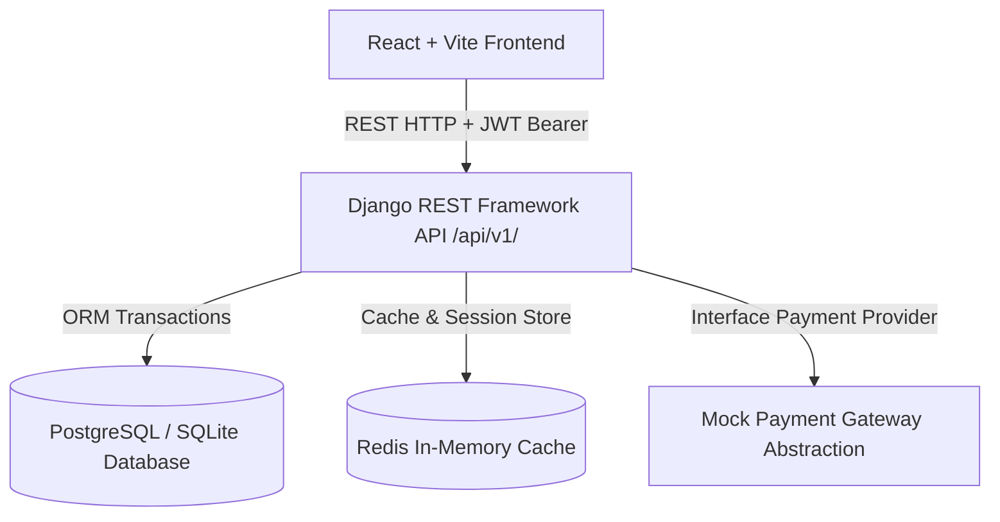

# 🏗️ APNI DUKAN — System Architecture & Design Specification

## Overview
APNI DUKAN is a production-grade, modular fashion e-commerce application built with a decoupled architecture. The backend is implemented as a Django REST Framework API with PostgreSQL/SQLite, while the frontend is a modern React 18 single-page application built with Vite, TypeScript, TailwindCSS, Zustand, and TanStack React Query.

---

## High-Level Component Diagram

---

## Modular Domain Architecture

### Backend Domain Modules (`backend/apps/`)
- `accounts`: User model (Email as username), JWT Authentication, Address snapshots, Role-Based Access Control (`CUSTOMER`, `ADMIN`, `STAFF`).
- `categories`: Hierarchy management for Categories and Subcategories.
- `products`: Product catalog, Brands, Product Variants (Size/Color/SKU), Images, stock quantities, and rating aggregates.
- `cart`: User Cart & CartItems with stock constraint checking.
- `wishlist`: Wishlist toggle & seamless item move-to-cart operations.
- `coupons`: Percentage/Fixed coupon validation engine with start/expiry dates, min order amounts, max discounts, and per-user limits.
- `orders`: Transactional checkout engine (`db.transaction.atomic()`), order number generator, address snapshots, stock deduction, and status workflow history.
- `payments`: `PaymentProvider` abstraction interface, `MockPaymentProvider`, and `PaymentTransaction` records.
- `inventory`: Audit trail for stock changes (`PURCHASE`, `SALE`, `RETURN`, `ADJUSTMENT`, `RESERVATION`).
- `reviews`: Verified purchase verification, 1-5 star ratings, and automatic product rating calculation.
- `notifications`: User notification system.
- `common`: Centralized exception handling, custom pagination, and base models.

---

## Security Architecture
1. **Authentication**: SimpleJWT Access Token (60 mins) & Refresh Token (7 days) with token blacklisting on logout.
2. **Authorization**: DRF Permission classes (`IsAuthenticated`, `IsAdminUserRole`, `IsStaffUserRole`, `IsOwnerOrAdmin`).
3. **Price & Stock Integrity**: Backend acts as the sole source of truth. Frontend prices are ignored during checkout; all item totals, coupons, shipping fees, and inventory checks are re-calculated on the backend inside atomic database transactions.
